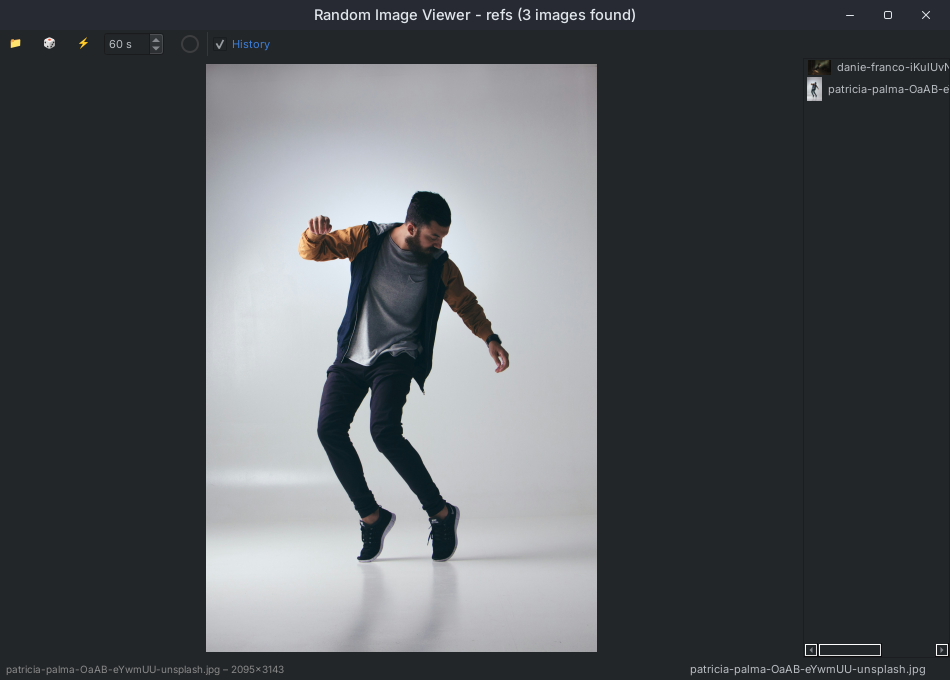
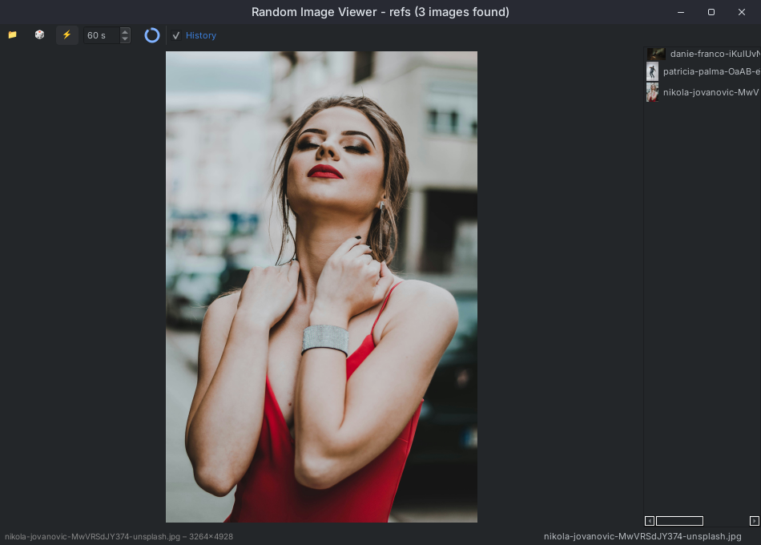

# Random Image Viewer

A simple, modern, **cross-platform** desktop app to view random images from any folder (including subfolders). Great for artists, inspiration, or just browsing your photo collection!

---

## Features

- 📁 **Open Any Folder:** Load images from a folder and its subfolders.
- 🎲 **Random Image:** Instantly show a random image, avoiding repeats until all are seen.
- ⏮️ ⏭️ **History Navigation:** Go back and forward through viewed images.
- 🕒 **Auto-Advance Timer:** Automatically switch to a new random image at set intervals, with a circular countdown overlay.
- 🔍 **Zoom:** Zoom in/out/reset with mouse wheel, keyboard, or context menu.
- 🖱️ **Context Menu:** Right-click the image for all main actions (open folder, next/prev, zoom, timer, settings, etc.).
- 🌑 **Dark Theme:** Clean, minimal dark UI.
- 🖥️ **Cross-platform:** Works on Windows, macOS, and Linux.

+

## New Feature: Free Line Drawing Tool

### Overview
Added a new line drawing tool that allows users to draw straight lines between any two points on the image using a 2-click interface, complementing the existing vertical and horizontal line tools.

### Key Features

#### 🎯 **Two-Click Line Creation**
- **First click**: Sets the start point of the line
- **Second click**: Completes the line by setting the end point
- **Third click**: Automatically starts a new line
- Visual feedback in status bar showing current operation state

#### 🛠️ **UI Integration**
- **New toolbar button**: `╱` icon for free line drawing mode
- **Mutually exclusive modes**: Only one line drawing tool can be active at a time
- **Cross cursor**: Visual indicator when free line mode is active
- **Status messages**: Real-time feedback for user interactions

#### 🔄 **Full Rotation Support**
- **Complete coordinate transformation**: Lines maintain correct positions during 90°, 180°, and 270° image rotations
- **Consistent behavior**: Matches the transformation logic of existing vertical/horizontal line tools
- **All zoom levels**: Works correctly at any zoom factor and pan position

#### 🎨 **Visual Consistency**
- **Same styling**: Uses identical white color and user-configurable thickness (1-10px)
- **Integrated rendering**: Drawn with the same QPainter system as other lines
- **Anti-aliasing**: Clean, smooth line appearance

#### 📐 **Enhanced Line Management**
- **Unified undo system**: "Undo Last Line" button works with all line types (prioritizes free lines → horizontal → vertical)
- **Clear all functionality**: "Clear All Lines" button removes all line types including free lines
- **Persistent across images**: Lines are cleared when navigating to new images
- **Copy integration**: Free lines are included when copying images to clipboard

#### 🐛 **Robust Rendering**
- **Improved bounds checking**: Prevents lines from disappearing at certain zoom levels
- **Tolerance handling**: 10-pixel tolerance prevents precision issues from hiding lines
- **QPainter clipping**: Automatic clipping for lines extending beyond visible area
- **Performance optimized**: Efficient coordinate transformation and caching

### Technical Implementation

#### **New Class Properties**
```python
self.free_line_drawing_mode = False
self.drawn_free_lines = []  # List of {start: (x,y), end: (x,y)} dictionaries
self.current_line_start = None  # Tracks first click point
```

#### **Enhanced Methods**
- `toggle_free_line_drawing()`: Activates/deactivates free line mode
- `add_free_line_point()`: Handles two-click line creation workflow
- Enhanced `display_image()`: Renders free lines with full rotation support
- Enhanced `undo_last_line()`: Supports all line types
- Enhanced `clear_lines()`: Clears all line types

#### **Coordinate Transformation**
Implements precise coordinate transformation for all rotation angles:
- **90°**: `(x,y) → (width-y, x)`
- **180°**: `(x,y) → (width-x, height-y)`
- **270°**: `(x,y) → (y, height-x)`
- **0°**: `(x,y) → (x,y)` (no transformation)

### Usage
1. Click the `╱` button to activate free line drawing mode
2. Click on the image to set the start point of your line
3. Click a second point to complete the line
4. Click a third point to start drawing another line
5. Use the undo button (↶) to remove the last drawn line
6. Use the trash button (🗑) to clear all lines

### Integration Benefits
- **Seamless workflow**: Integrates perfectly with existing zoom, pan, rotation, and enhancement features
- **Consistent UX**: Follows the same interaction patterns as vertical/horizontal line tools
- **Professional quality**: Enterprise-grade coordinate transformation and rendering system
- **Performance optimized**: Uses the same efficient caching and rendering pipeline

This feature transforms the image viewer from having basic vertical/horizontal line capabilities to a comprehensive line annotation tool suitable for detailed image analysis and markup workflows.

---

## Installation

1. **Clone this repo:**
   ```sh
   git clone https://github.com/YOUR_USERNAME/random-image-viewer.git
   cd random-image-viewer
   ```

2. **Install [uv](https://github.com/astral-sh/uv) (if you don't have it):**
   ```sh
   pip install uv
   ```

3. **Install dependencies:**
   ```sh
   uv pip install -r pyproject.toml
   # or just
   uv pip install pyside6
   ```

---

## How to Run

- **With uv:**
  ```sh
  uv run main.py
  ```
- **Or with Python:**
  ```sh
  python main.py
  ```

---

## Usage

1. **Open a Folder:**
   - Right-click the image area and select "Open Folder".
2. **Show Random Image:**
   - Right-click and choose "Next Random Image", or press the **Right Arrow** key.
3. **Navigate History:**
   - Use **Left/Right Arrow** keys, or the context menu.
   - Enable the history panel from the context menu to click through viewed images.
4. **Auto-Advance:**
   - Enable from the context menu ("Enable Timer").
   - Adjust interval in the context menu.
   - A circular timer appears as an overlay.
5. **Zoom:**
   - Use mouse wheel over the image, keyboard shortcuts, or context menu.
6. **Other Actions:**
   - Flip image, toggle grayscale, change background, and more—all from the context menu.

---

## Keyboard Shortcuts & Context Menu Actions

- **Left Arrow:** Previous image
- **Right Arrow:** Next image (random if at end)
- **Ctrl + +:** Zoom in
- **Ctrl + -:** Zoom out
- **Ctrl + 0:** Reset zoom
- **Context Menu (right-click):**
  - Open Folder
  - Previous/Next Random Image
  - Zoom In/Out/Reset
  - Enable Timer & set interval
  - Show History Panel
  - Grayscale, Flip, Background color, etc.

---

## Screenshots


*Main window with random image loaded*


*History panel enabled and showing viewed images*


*Pie timer overlay and auto-advance controls*

---

## Compiling to a Standalone Binary

You can compile this app to a standalone executable for Windows, Linux, or Mac using [PyInstaller](https://pyinstaller.org/).

1. **Install PyInstaller:**
   ```sh
   uv pip install pyinstaller
   ```
2. **Build the Executable:**
   ```sh
   pyinstaller --noconfirm --onefile --windowed main.py
   ```
   - The binary will be in the `dist/` folder.
   - For cross-compiling, build on the target OS or use a cross-compilation toolchain.

---

## Requirements

- Python 3.8+
- [PySide6](https://pypi.org/project/PySide6/)

---

## License

MIT License.

---


**Enjoy browsing your images!**

